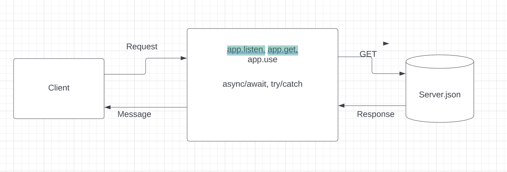

# City Explorer API

**Author**: Ryan Apodaca
**Version**: 1.0.0 

## Overview

This app provides the latitude and longitude, a map, weather, and associated movie information when you serahc for a location or place.

## Getting Started
Just type in a location and click "explore!"

## Credit and Collaborations
This product uses location IQ, WeatherBit, and themoviedb.org APIs.

